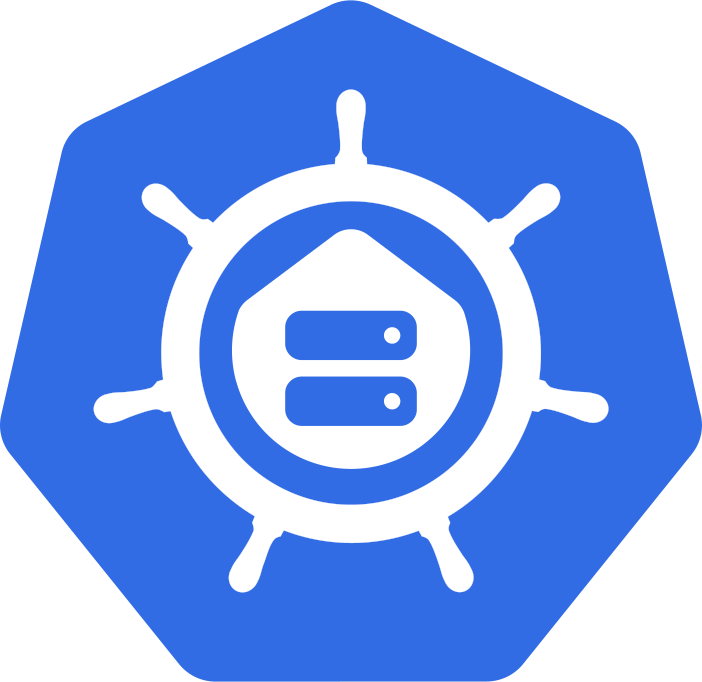

<div align="center">

### My Home Operations Repository :octocat:

_... managed with Flux and Renovate, and GitHub Actions_ :robot:

[](https://github.com/kashalls/kromgo/)&nbsp;&nbsp;
[](https://github.com/kashalls/kromgo/)&nbsp;&nbsp;
[](https://github.com/kashalls/kromgo/)&nbsp;&nbsp;
[](https://github.com/kashalls/kromgo/)&nbsp;&nbsp;
[](https://github.com/kashalls/kromgo/)

</div>

## 📖 Overview

This is a mono repository for my home infrastructure and Kubernetes cluster. I try to adhere to Infrastructure as Code (IaC) and GitOps practices using tools like [Terraform](https://www.terraform.io/), [Kubernetes](https://kubernetes.io/), [FluxCD](https://github.com/fluxcd/flux2), [Renovate](https://github.com/renovatebot/renovate), and [GitHub Actions](https://github.com/features/actions).

## ⛵ Kubernetes

There is a template over at [onedr0p/flux-cluster-template](https://github.com/onedr0p/flux-cluster-template) if you want to try and follow along with some of the practices I use here.

### Installation

My cluster is [k3s](https://k3s.io/) provisioned overtop bare-metal Ubuntu. This is a semi-hyper-converged cluster, workloads and block storage are sharing the same available resources on my nodes while I have a separate server with BTRFS for NFS/SMB shares, bulk file storage and backups.

### Core Components

- [cilium](https://github.com/cilium/cilium): internal Kubernetes networking plugin
- [cert-manager](https://cert-manager.io/docs/): creates SSL certificates for services in my cluster
- [external-dns](https://github.com/kubernetes-sigs/external-dns): automatically syncs DNS records from my cluster ingresses to a DNS provider
- [ingress-nginx](https://github.com/kubernetes/ingress-nginx/): ingress controller for Kubernetes using NGINX as a reverse proxy and load balancer
- [sops](https://toolkit.fluxcd.io/guides/mozilla-sops/): managed secrets for Kubernetes, Ansible, and Terraform which are committed to Git

### GitOps

[FluxCD](https://github.com/fluxcd/flux2) watches the clusters in my [kubernetes](./kubernetes/) folder (see Directories below) and makes the changes to my clusters based on the state of my Git repository.

The way Flux works for me here is it will recursively search the `kubernetes/${cluster}/apps` folder until it finds the most top level `kustomization.yaml` per directory and then apply all the resources listed in it. That aforementioned `kustomization.yaml` will generally only have a namespace resource and one or many Flux kustomizations (`ks.yaml`). Under the control of those Flux kustomizations there will be a `HelmRelease` or other resources related to the application which will be applied.

[Renovate](https://github.com/renovatebot/renovate) watches my **entire** repository looking for dependency updates, when they are found a PR is automatically created. When some PRs are merged Flux applies the changes to my cluster.

### Directories

This Git repository contains the following directories under [Kubernetes](./kubernetes/).

```sh
📁 kubernetes
├── 📁 apps           # applications
├── 📁 bootstrap      # bootstrap procedures
├── 📁 flux           # core flux configuration
└── 📁 templates      # re-useable components
```

### Repo Index

<!-- Begin apps section -->
<h3>Clusters</h3>
<ul>
  <li><a href="#gabernetes">gabernetes</a></li>
  <li><a href="#templates">templates</a></li>
  <li><a href="#tennant">tennant</a></li>
</ul>

<h3>Apps</h2>

<h4>gabernetes</h2>
<table>
  <tr>
    <th>Namespace</th>
    <th>Kind</th>
    <th>Name</th>
    <th>Supporting Services</th>
  </tr>
  <tr>
    <td rowspan="2">adguard-home</td>
    <td><code>HelmRelease</code></td>
    <td><a href="kubernetes/gabernetes/apps/adguard-home/app/helmrelease.yaml">adguard-home</a></td>
    <td rowspan="2"><a href="kubernetes/gabernetes/apps/adguard-home/borgmatic/helmrelease.yaml">borgmatic</a></td>
  </tr>
  <tr>
    <td><code>HelmRelease</code></td>
    <td><a href="kubernetes/gabernetes/apps/adguard-home/external-dns/helmrelease.yaml">adguard-home-external-dns</a></td>
  </tr>
  <tr>
    <td>ascii-movie</td>
    <td><code>HelmRelease</code></td>
    <td><a href="kubernetes/gabernetes/apps/ascii-movie/app/helmrelease.yaml">ascii-movie</a></td>
    <td></td>
  </tr>
  <tr>
    <td>authentik</td>
    <td><code>HelmRelease</code></td>
    <td><a href="kubernetes/gabernetes/apps/authentik/app/helmrelease.yaml">authentik</a></td>
    <td><a href="kubernetes/gabernetes/apps/authentik/borgmatic/helmrelease.yaml">borgmatic</a>, <a href="kubernetes/gabernetes/apps/authentik/postgresql.yaml">postgresql</a>, <a href="kubernetes/gabernetes/apps/authentik/redis/helmrelease.yaml">redis</a></td>
  </tr>
  <tr>
    <td>bookstack</td>
    <td><code>HelmRelease</code></td>
    <td><a href="kubernetes/gabernetes/apps/bookstack/app/helmrelease.yaml">bookstack</a></td>
    <td><a href="kubernetes/gabernetes/apps/bookstack/borgmatic/helmrelease.yaml">borgmatic</a></td>
  </tr>
  <tr>
    <td>castsponsorskip</td>
    <td><code>HelmRelease</code></td>
    <td><a href="kubernetes/gabernetes/apps/castsponsorskip/app/helmrelease.yaml">castsponsorskip</a></td>
    <td></td>
  </tr>
  <tr>
    <td>change-detection</td>
    <td><code>HelmRelease</code></td>
    <td><a href="kubernetes/gabernetes/apps/change-detection/app/helmrelease.yaml">change-detection</a></td>
    <td></td>
  </tr>
  <tr>
    <td>charm</td>
    <td><code>HelmRelease</code></td>
    <td><a href="kubernetes/gabernetes/apps/charm/app/helmrelease.yaml">charm</a></td>
    <td></td>
  </tr>
  <tr>
    <td>cnpg-system</td>
    <td><code>HelmRelease</code></td>
    <td><a href="kubernetes/gabernetes/apps/cnpg/app/helmrelease.yaml">cnpg</a></td>
    <td></td>
  </tr>
  <tr>
    <td>domain-watch</td>
    <td><code>HelmRelease</code></td>
    <td><a href="kubernetes/gabernetes/apps/domain-watch/app/helmrelease.yaml">domain-watch</a></td>
    <td></td>
  </tr>
  <tr>
    <td>esphome</td>
    <td><code>HelmRelease</code></td>
    <td><a href="kubernetes/gabernetes/apps/esphome/app/helmrelease.yaml">esphome</a></td>
    <td><a href="kubernetes/gabernetes/apps/esphome/borgmatic/helmrelease.yaml">borgmatic</a></td>
  </tr>
  <tr>
    <td>external-dns</td>
    <td><code>HelmRelease</code></td>
    <td><a href="kubernetes/gabernetes/apps/external-dns/dynamic-ip/helmrelease.yaml">dynamic-ip</a></td>
    <td></td>
  </tr>
  <tr>
    <td rowspan="2">flux-system</td>
    <td><code>GitRepository</code></td>
    <td><a href="https://github.com/gabe565/home-ops">home-ops</a></td>
    <td rowspan="2"></td>
  </tr>
  <tr>
    <td><code>GitRepository</code></td>
    <td><a href="https://github.com/gabe565/home-ops-private">home-ops-private</a></td>
  </tr>
  <tr>
    <td>generic-device-plugin</td>
    <td><code>HelmRelease</code></td>
    <td><a href="kubernetes/gabernetes/apps/generic-device-plugin/app/helmrelease.yaml">generic-device-plugin</a></td>
    <td></td>
  </tr>
  <tr>
    <td>geoip</td>
    <td><code>HelmRelease</code></td>
    <td><a href="kubernetes/gabernetes/apps/geoip/app/helmrelease.yaml">geoip</a></td>
    <td><a href="kubernetes/gabernetes/apps/geoip/redis/helmrelease.yaml">redis</a></td>
  </tr>
  <tr>
    <td>gitea</td>
    <td><code>HelmRelease</code></td>
    <td><a href="kubernetes/gabernetes/apps/gitea/app/helmrelease.yaml">gitea</a></td>
    <td><a href="kubernetes/gabernetes/apps/gitea/borgmatic/helmrelease.yaml">borgmatic</a>, <a href="kubernetes/gabernetes/apps/gitea/postgresql.yaml">postgresql</a>, <a href="kubernetes/gabernetes/apps/gitea/redis/helmrelease.yaml">redis</a></td>
  </tr>
  <tr>
    <td>hammond</td>
    <td><code>HelmRelease</code></td>
    <td><a href="kubernetes/gabernetes/apps/hammond/app/helmrelease.yaml">hammond</a></td>
    <td></td>
  </tr>
  <tr>
    <td>headscale</td>
    <td><code>HelmRelease</code></td>
    <td><a href="kubernetes/gabernetes/apps/headscale/app/helmrelease.yaml">headscale</a></td>
    <td><a href="kubernetes/gabernetes/apps/headscale/borgmatic/helmrelease.yaml">borgmatic</a>, <a href="kubernetes/gabernetes/apps/headscale/postgresql.yaml">postgresql</a></td>
  </tr>
  <tr>
    <td>healthchecks</td>
    <td><code>HelmRelease</code></td>
    <td><a href="kubernetes/gabernetes/apps/healthchecks/app/helmrelease.yaml">healthchecks</a></td>
    <td><a href="kubernetes/gabernetes/apps/healthchecks/borgmatic/helmrelease.yaml">borgmatic</a>, <a href="kubernetes/gabernetes/apps/healthchecks/postgresql.yaml">postgresql</a></td>
  </tr>
  <tr>
    <td rowspan="2">home-assistant</td>
    <td><code>HelmRelease</code></td>
    <td><a href="kubernetes/gabernetes/apps/home-assistant/app/helmrelease.yaml">home-assistant</a></td>
    <td rowspan="2"><a href="kubernetes/gabernetes/apps/home-assistant/borgmatic/helmrelease.yaml">borgmatic</a>, <a href="kubernetes/gabernetes/apps/home-assistant/postgresql.yaml">postgresql</a></td>
  </tr>
  <tr>
    <td><code>HelmRelease</code></td>
    <td><a href="kubernetes/gabernetes/apps/home-assistant/piper/helmrelease.yaml">piper</a></td>
  </tr>
  <tr>
    <td>homepage</td>
    <td><code>HelmRelease</code></td>
    <td><a href="kubernetes/gabernetes/apps/homepage/app/helmrelease.yaml">homepage</a></td>
    <td></td>
  </tr>
  <tr>
    <td>immich</td>
    <td><code>HelmRelease</code></td>
    <td><a href="kubernetes/gabernetes/apps/immich/app/helmrelease.yaml">immich</a></td>
    <td><a href="kubernetes/gabernetes/apps/immich/borgmatic/helmrelease.yaml">borgmatic</a>, <a href="kubernetes/gabernetes/apps/immich/postgresql.yaml">postgresql</a>, <a href="kubernetes/gabernetes/apps/immich/redis/helmrelease.yaml">redis</a></td>
  </tr>
  <tr>
    <td>intel-gpu-plugin</td>
    <td><code>GitRepository</code></td>
    <td><a href="https://github.com/intel/intel-device-plugins-for-kubernetes">intel-gpu-plugin</a></td>
    <td></td>
  </tr>
  <tr>
    <td>kromgo</td>
    <td><code>HelmRelease</code></td>
    <td><a href="kubernetes/gabernetes/apps/prometheus/kromgo/helmrelease.yaml">kromgo</a></td>
    <td></td>
  </tr>
  <tr>
    <td rowspan="4">kube-system</td>
    <td><code>HelmRelease</code></td>
    <td><a href="kubernetes/gabernetes/apps/cilium/app/helmrelease.yaml">cilium</a></td>
    <td rowspan="4"></td>
  </tr>
  <tr>
    <td><code>HelmRelease</code></td>
    <td><a href="kubernetes/gabernetes/apps/kube-vip/app/helmrelease.yaml">kube-vip</a></td>
  </tr>
  <tr>
    <td><code>HelmRelease</code></td>
    <td><a href="kubernetes/gabernetes/apps/metrics-server/app/helmrelease.yaml">metrics-server</a></td>
  </tr>
  <tr>
    <td><code>GitRepository</code></td>
    <td><a href="https://github.com/k8snetworkplumbingwg/multus-cni">multus</a></td>
  </tr>
  <tr>
    <td>lidarr</td>
    <td><code>HelmRelease</code></td>
    <td><a href="kubernetes/gabernetes/apps/lidarr/app/helmrelease.yaml">lidarr</a></td>
    <td></td>
  </tr>
  <tr>
    <td>linkding</td>
    <td><code>HelmRelease</code></td>
    <td><a href="kubernetes/gabernetes/apps/linkding/app/helmrelease.yaml">linkding</a></td>
    <td><a href="kubernetes/gabernetes/apps/linkding/borgmatic/helmrelease.yaml">borgmatic</a>, <a href="kubernetes/gabernetes/apps/linkding/postgresql.yaml">postgresql</a></td>
  </tr>
  <tr>
    <td>longhorn-system</td>
    <td><code>HelmRelease</code></td>
    <td><a href="kubernetes/gabernetes/apps/longhorn/app/helmrelease.yaml">longhorn</a></td>
    <td></td>
  </tr>
  <tr>
    <td>matrimony</td>
    <td><code>HelmRelease</code></td>
    <td><a href="kubernetes/gabernetes/apps/matrimony/app/helmrelease.yaml">matrimony</a></td>
    <td><a href="kubernetes/gabernetes/apps/matrimony/borgmatic/helmrelease.yaml">borgmatic</a></td>
  </tr>
  <tr>
    <td>mattermost</td>
    <td><code>HelmRelease</code></td>
    <td><a href="kubernetes/gabernetes/apps/mattermost/app/helmrelease.yaml">mattermost</a></td>
    <td><a href="kubernetes/gabernetes/apps/mattermost/borgmatic/helmrelease.yaml">borgmatic</a>, <a href="kubernetes/gabernetes/apps/mattermost/app/postgresql.yaml">postgresql</a></td>
  </tr>
  <tr>
    <td>memos</td>
    <td><code>HelmRelease</code></td>
    <td><a href="kubernetes/gabernetes/apps/memos/app/helmrelease.yaml">memos</a></td>
    <td><a href="kubernetes/gabernetes/apps/memos/borgmatic/helmrelease.yaml">borgmatic</a>, <a href="kubernetes/gabernetes/apps/memos/postgresql.yaml">postgresql</a></td>
  </tr>
  <tr>
    <td>metallb-system</td>
    <td><code>HelmRelease</code></td>
    <td><a href="kubernetes/gabernetes/apps/metallb/app/helmrelease.yaml">metallb</a></td>
    <td></td>
  </tr>
  <tr>
    <td>miniflux</td>
    <td><code>HelmRelease</code></td>
    <td><a href="kubernetes/gabernetes/apps/miniflux/app/helmrelease.yaml">miniflux</a></td>
    <td><a href="kubernetes/gabernetes/apps/miniflux/borgmatic/helmrelease.yaml">borgmatic</a>, <a href="kubernetes/gabernetes/apps/miniflux/postgresql.yaml">postgresql</a></td>
  </tr>
  <tr>
    <td>minio</td>
    <td><code>HelmRelease</code></td>
    <td><a href="kubernetes/gabernetes/apps/minio/app/helmrelease.yaml">minio</a></td>
    <td><a href="kubernetes/gabernetes/apps/minio/borgmatic/helmrelease.yaml">borgmatic</a></td>
  </tr>
  <tr>
    <td>monica</td>
    <td><code>HelmRelease</code></td>
    <td><a href="kubernetes/gabernetes/apps/monica/app/helmrelease.yaml">monica</a></td>
    <td><a href="kubernetes/gabernetes/apps/monica/borgmatic/helmrelease.yaml">borgmatic</a></td>
  </tr>
  <tr>
    <td>mosquitto</td>
    <td><code>HelmRelease</code></td>
    <td><a href="kubernetes/gabernetes/apps/mosquitto/app/helmrelease.yaml">mosquitto</a></td>
    <td></td>
  </tr>
  <tr>
    <td>nextcloud</td>
    <td><code>HelmRelease</code></td>
    <td><a href="kubernetes/gabernetes/apps/nextcloud/app/helmrelease.yaml">nextcloud</a></td>
    <td><a href="kubernetes/gabernetes/apps/nextcloud/borgmatic/helmrelease.yaml">borgmatic</a>, <a href="kubernetes/gabernetes/apps/nextcloud/postgresql.yaml">postgresql</a></td>
  </tr>
  <tr>
    <td>nfs-provisioner</td>
    <td><code>HelmRelease</code></td>
    <td><a href="kubernetes/gabernetes/apps/nfs-subdir-external-provisioner/app/helmrelease.yaml">nfs-subdir-external-provisioner</a></td>
    <td></td>
  </tr>
  <tr>
    <td>nightscout</td>
    <td><code>HelmRelease</code></td>
    <td><a href="kubernetes/gabernetes/apps/nightscout/app/helmrelease.yaml">nightscout</a></td>
    <td><a href="kubernetes/gabernetes/apps/nightscout/borgmatic/helmrelease.yaml">borgmatic</a></td>
  </tr>
  <tr>
    <td>node-feature-discovery</td>
    <td><code>HelmRelease</code></td>
    <td><a href="kubernetes/gabernetes/apps/node-feature-discovery/app/helmrelease.yaml">node-feature-discovery</a></td>
    <td></td>
  </tr>
  <tr>
    <td>nvidia-device-plugin</td>
    <td><code>HelmRelease</code></td>
    <td><a href="kubernetes/gabernetes/apps/nvidia-device-plugin/app/helmrelease.yaml">nvidia-device-plugin</a></td>
    <td></td>
  </tr>
  <tr>
    <td>obico</td>
    <td><code>HelmRelease</code></td>
    <td><a href="kubernetes/gabernetes/apps/obico/app/helmrelease.yaml">obico</a></td>
    <td><a href="kubernetes/gabernetes/apps/obico/borgmatic/helmrelease.yaml">borgmatic</a></td>
  </tr>
  <tr>
    <td>open-webui</td>
    <td><code>HelmRelease</code></td>
    <td><a href="kubernetes/gabernetes/apps/open-webui/app/helmrelease.yaml">open-webui</a></td>
    <td><a href="kubernetes/gabernetes/apps/open-webui/borgmatic/helmrelease.yaml">borgmatic</a>, <a href="kubernetes/gabernetes/apps/open-webui/app/postgresql.yaml">postgresql</a></td>
  </tr>
  <tr>
    <td>overseerr</td>
    <td><code>HelmRelease</code></td>
    <td><a href="kubernetes/gabernetes/apps/overseerr/app/helmrelease.yaml">overseerr</a></td>
    <td><a href="kubernetes/gabernetes/apps/overseerr/borgmatic/helmrelease.yaml">borgmatic</a></td>
  </tr>
  <tr>
    <td>paperless-ngx</td>
    <td><code>HelmRelease</code></td>
    <td><a href="kubernetes/gabernetes/apps/paperless-ngx/app/helmrelease.yaml">paperless-ngx</a></td>
    <td><a href="kubernetes/gabernetes/apps/paperless-ngx/borgmatic/helmrelease.yaml">borgmatic</a>, <a href="kubernetes/gabernetes/apps/paperless-ngx/postgresql.yaml">postgresql</a>, <a href="kubernetes/gabernetes/apps/paperless-ngx/redis/helmrelease.yaml">redis</a></td>
  </tr>
  <tr>
    <td>pictshare</td>
    <td><code>HelmRelease</code></td>
    <td><a href="kubernetes/gabernetes/apps/pictshare/app/helmrelease.yaml">pictshare</a></td>
    <td></td>
  </tr>
  <tr>
    <td>plausible</td>
    <td><code>HelmRelease</code></td>
    <td><a href="kubernetes/gabernetes/apps/plausible/app/helmrelease.yaml">plausible</a></td>
    <td><a href="kubernetes/gabernetes/apps/plausible/clickhouse/helmrelease.yaml">clickhouse</a>, <a href="kubernetes/gabernetes/apps/plausible/app/postgresql.yaml">postgresql</a></td>
  </tr>
  <tr>
    <td>plex</td>
    <td><code>HelmRelease</code></td>
    <td><a href="kubernetes/gabernetes/apps/plex/app/helmrelease.yaml">plex</a></td>
    <td><a href="kubernetes/gabernetes/apps/plex/borgmatic/helmrelease.yaml">borgmatic</a></td>
  </tr>
  <tr>
    <td rowspan="2">prometheus</td>
    <td><code>HelmRelease</code></td>
    <td><a href="kubernetes/gabernetes/apps/prometheus/app/helmrelease.yaml">kube-prometheus-stack</a></td>
    <td rowspan="2"><a href="kubernetes/gabernetes/apps/prometheus/borgmatic/helmrelease.yaml">borgmatic</a></td>
  </tr>
  <tr>
    <td><code>HelmRelease</code></td>
    <td><a href="kubernetes/gabernetes/apps/prometheus/app/nut-exporter.yaml">nut-exporter</a></td>
  </tr>
  <tr>
    <td>prowlarr</td>
    <td><code>HelmRelease</code></td>
    <td><a href="kubernetes/gabernetes/apps/prowlarr/app/helmrelease.yaml">prowlarr</a></td>
    <td><a href="kubernetes/gabernetes/apps/prowlarr/borgmatic/helmrelease.yaml">borgmatic</a></td>
  </tr>
  <tr>
    <td>qbittorrent</td>
    <td><code>HelmRelease</code></td>
    <td><a href="kubernetes/gabernetes/apps/qbittorrent/app/helmrelease.yaml">qbittorrent</a></td>
    <td><a href="kubernetes/gabernetes/apps/qbittorrent/borgmatic/helmrelease.yaml">borgmatic</a></td>
  </tr>
  <tr>
    <td>radarr</td>
    <td><code>HelmRelease</code></td>
    <td><a href="kubernetes/gabernetes/apps/radarr/app/helmrelease.yaml">radarr</a></td>
    <td><a href="kubernetes/gabernetes/apps/radarr/borgmatic/helmrelease.yaml">borgmatic</a></td>
  </tr>
  <tr>
    <td>relax-sounds</td>
    <td><code>HelmRelease</code></td>
    <td><a href="kubernetes/gabernetes/apps/relax-sounds/app/helmrelease.yaml">relax-sounds</a></td>
    <td><a href="kubernetes/gabernetes/apps/relax-sounds/borgmatic/helmrelease.yaml">borgmatic</a></td>
  </tr>
  <tr>
    <td rowspan="2">renovate</td>
    <td><code>HelmRelease</code></td>
    <td><a href="kubernetes/gabernetes/apps/renovate/app/helmrelease.yaml">renovate</a></td>
    <td rowspan="2"><a href="kubernetes/gabernetes/apps/renovate/postgresql.yaml">postgresql</a></td>
  </tr>
  <tr>
    <td><code>HelmRelease</code></td>
    <td><a href="kubernetes/gabernetes/apps/renovate/app/exporter.yaml">renovate-exporter</a></td>
  </tr>
  <tr>
    <td>scanservjs</td>
    <td><code>HelmRelease</code></td>
    <td><a href="kubernetes/gabernetes/apps/scanservjs/app/helmrelease.yaml">scanservjs</a></td>
    <td></td>
  </tr>
  <tr>
    <td>shlink</td>
    <td><code>HelmRelease</code></td>
    <td><a href="kubernetes/gabernetes/apps/shlink/app/helmrelease.yaml">shlink</a></td>
    <td><a href="kubernetes/gabernetes/apps/shlink/borgmatic/helmrelease.yaml">borgmatic</a>, <a href="kubernetes/gabernetes/apps/shlink/postgresql.yaml">postgresql</a></td>
  </tr>
  <tr>
    <td>sonarr</td>
    <td><code>HelmRelease</code></td>
    <td><a href="kubernetes/gabernetes/apps/sonarr/app/helmrelease.yaml">sonarr</a></td>
    <td><a href="kubernetes/gabernetes/apps/sonarr/borgmatic/helmrelease.yaml">borgmatic</a></td>
  </tr>
  <tr>
    <td>stable-diffusion</td>
    <td><code>HelmRelease</code></td>
    <td><a href="kubernetes/gabernetes/apps/stable-diffusion/app/helmrelease.yaml">stable-diffusion-webui</a></td>
    <td></td>
  </tr>
  <tr>
    <td>stirling-pdf</td>
    <td><code>HelmRelease</code></td>
    <td><a href="kubernetes/gabernetes/apps/stirling-pdf/app/helmrelease.yaml">stirling-pdf</a></td>
    <td></td>
  </tr>
  <tr>
    <td>system-upgrade</td>
    <td><code>GitRepository</code></td>
    <td><a href="https://github.com/rancher/system-upgrade-controller">system-upgrade-controller</a></td>
    <td></td>
  </tr>
  <tr>
    <td>tandoor</td>
    <td><code>HelmRelease</code></td>
    <td><a href="kubernetes/gabernetes/apps/tandoor/app/helmrelease.yaml">tandoor</a></td>
    <td><a href="kubernetes/gabernetes/apps/tandoor/borgmatic/helmrelease.yaml">borgmatic</a>, <a href="kubernetes/gabernetes/apps/tandoor/postgresql.yaml">postgresql</a></td>
  </tr>
  <tr>
    <td>tautulli</td>
    <td><code>HelmRelease</code></td>
    <td><a href="kubernetes/gabernetes/apps/tautulli/app/helmrelease.yaml">tautulli</a></td>
    <td><a href="kubernetes/gabernetes/apps/tautulli/borgmatic/helmrelease.yaml">borgmatic</a></td>
  </tr>
  <tr>
    <td>theme-park</td>
    <td><code>HelmRelease</code></td>
    <td><a href="kubernetes/gabernetes/apps/theme-park/app/helmrelease.yaml">theme-park</a></td>
    <td></td>
  </tr>
  <tr>
    <td>transsmute</td>
    <td><code>HelmRelease</code></td>
    <td><a href="kubernetes/gabernetes/apps/transsmute/app/helmrelease.yaml">transsmute</a></td>
    <td></td>
  </tr>
  <tr>
    <td>uptime-kuma</td>
    <td><code>HelmRelease</code></td>
    <td><a href="kubernetes/gabernetes/apps/uptime-kuma/app/helmrelease.yaml">uptime-kuma</a></td>
    <td><a href="kubernetes/gabernetes/apps/uptime-kuma/borgmatic/helmrelease.yaml">borgmatic</a></td>
  </tr>
  <tr>
    <td>vaultwarden</td>
    <td><code>HelmRelease</code></td>
    <td><a href="kubernetes/gabernetes/apps/vaultwarden/app/helmrelease.yaml">vaultwarden</a></td>
    <td><a href="kubernetes/gabernetes/apps/vaultwarden/borgmatic/helmrelease.yaml">borgmatic</a>, <a href="kubernetes/gabernetes/apps/vaultwarden/postgresql.yaml">postgresql</a></td>
  </tr>
  <tr>
    <td>vikunja</td>
    <td><code>HelmRelease</code></td>
    <td><a href="kubernetes/gabernetes/apps/vikunja/app/helmrelease.yaml">vikunja</a></td>
    <td><a href="kubernetes/gabernetes/apps/vikunja/borgmatic/helmrelease.yaml">borgmatic</a>, <a href="kubernetes/gabernetes/apps/vikunja/postgresql.yaml">postgresql</a>, <a href="kubernetes/gabernetes/apps/vikunja/redis/helmrelease.yaml">redis</a></td>
  </tr>
  <tr>
    <td>weave-gitops</td>
    <td><code>HelmRelease</code></td>
    <td><a href="kubernetes/gabernetes/apps/weave-gitops/app/helmrelease.yaml">weave-gitops</a></td>
    <td></td>
  </tr>
  <tr>
    <td>zigbee2mqtt</td>
    <td><code>HelmRelease</code></td>
    <td><a href="kubernetes/gabernetes/apps/zigbee2mqtt/app/helmrelease.yaml">zigbee2mqtt</a></td>
    <td><a href="kubernetes/gabernetes/apps/zigbee2mqtt/borgmatic/helmrelease.yaml">borgmatic</a></td>
  </tr>
  <tr>
    <td>zwave-js-ui</td>
    <td><code>HelmRelease</code></td>
    <td><a href="kubernetes/gabernetes/apps/zwave-js-ui/app/helmrelease.yaml">zwave-js-ui</a></td>
    <td><a href="kubernetes/gabernetes/apps/zwave-js-ui/borgmatic/helmrelease.yaml">borgmatic</a></td>
  </tr>
</table>

<h4>templates</h2>
<table>
  <tr>
    <th>Namespace</th>
    <th>Kind</th>
    <th>Name</th>
    <th>Supporting Services</th>
  </tr>
  <tr>
    <td>cert-manager</td>
    <td><code>HelmRelease</code></td>
    <td><a href="kubernetes/templates/apps/cert-manager/app/helmrelease.yaml">cert-manager</a></td>
    <td></td>
  </tr>
  <tr>
    <td>external-dns</td>
    <td><code>HelmRelease</code></td>
    <td><a href="kubernetes/templates/apps/external-dns/helmrelease.yaml">external-dns</a></td>
    <td></td>
  </tr>
  <tr>
    <td>ingress-nginx</td>
    <td><code>HelmRelease</code></td>
    <td><a href="kubernetes/templates/apps/ingress-nginx/helmrelease.yaml">ingress-nginx</a></td>
    <td></td>
  </tr>
  <tr>
    <td>reflector</td>
    <td><code>HelmRelease</code></td>
    <td><a href="kubernetes/templates/apps/reflector/helmrelease.yaml">reflector</a></td>
    <td></td>
  </tr>
  <tr>
    <td>reloader</td>
    <td><code>HelmRelease</code></td>
    <td><a href="kubernetes/templates/apps/reloader/helmrelease.yaml">reloader</a></td>
    <td></td>
  </tr>
</table>

<h4>tennant</h2>
<table>
  <tr>
    <th>Namespace</th>
    <th>Kind</th>
    <th>Name</th>
    <th>Supporting Services</th>
  </tr>
  <tr>
    <td>ascii-movie</td>
    <td><code>HelmRelease</code></td>
    <td><a href="kubernetes/tennant/apps/ascii-movie/app/helmrelease.yaml">ascii-movie</a></td>
    <td></td>
  </tr>
  <tr>
    <td rowspan="2">flux-system</td>
    <td><code>GitRepository</code></td>
    <td><a href="https://github.com/gabe565/home-ops">home-ops</a></td>
    <td rowspan="2"></td>
  </tr>
  <tr>
    <td><code>GitRepository</code></td>
    <td><a href="https://github.com/gabe565/home-ops-private">home-ops-private</a></td>
  </tr>
  <tr>
    <td>portfolio</td>
    <td><code>HelmRelease</code></td>
    <td><a href="kubernetes/tennant/apps/portfolio/app/helmrelease.yaml">portfolio</a></td>
    <td><a href="kubernetes/tennant/apps/portfolio/borgmatic/helmrelease.yaml">borgmatic</a></td>
  </tr>
  <tr>
    <td>prometheus</td>
    <td><code>HelmRelease</code></td>
    <td><a href="kubernetes/tennant/apps/prometheus/app/helmrelease.yaml">kube-prometheus-stack</a></td>
    <td></td>
  </tr>
</table>
<!-- End apps section -->
